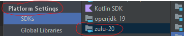
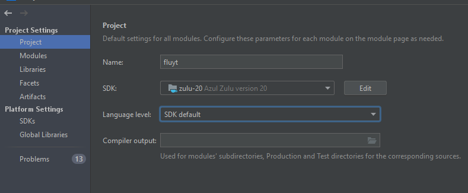
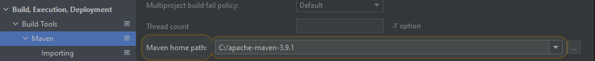
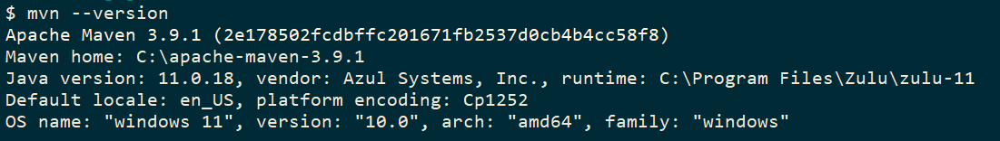
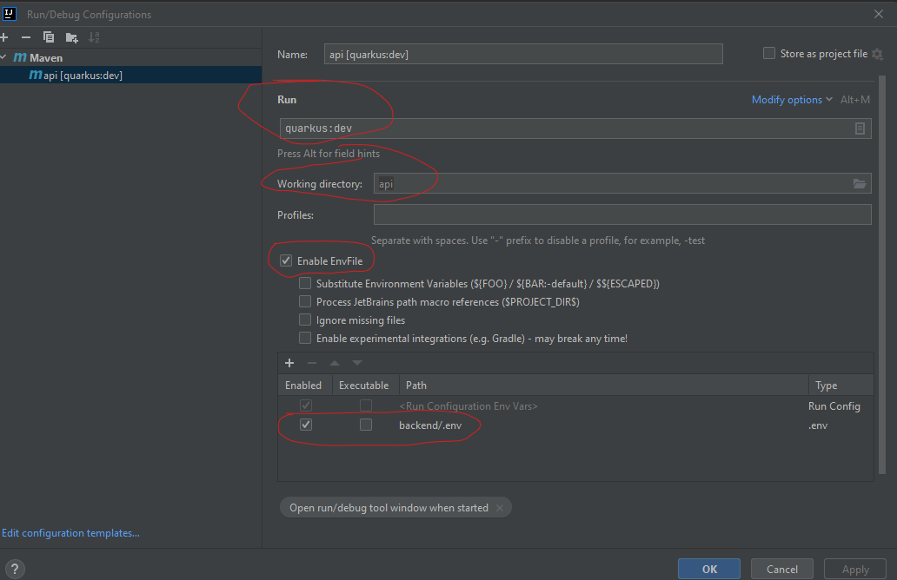
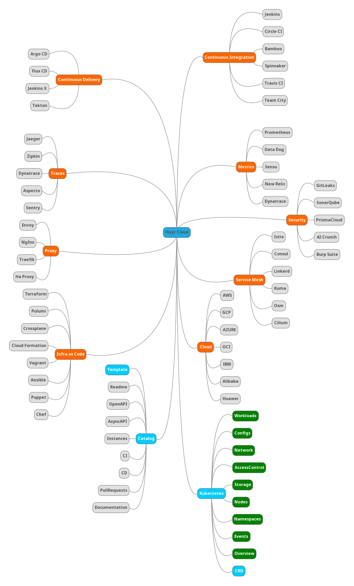

# Fluyt Cloud

This is an open-source project for a Single Pane of Glass web application, licensed under the Apache License. The application is developed using Quarkus with Java for the backend and Angular with TypeScript for the frontend.

Single Pane of Glass is a data visualization approach that allows users to view information from multiple sources in a single interface. This approach is especially useful for monitoring complex systems, where many pieces of information need to be monitored simultaneously.

### How to Contribute

If you would like to contribute to the project, you can follow these steps:

1. Fork this repository
2. Clone your fork to your local machine
3. Install dependencies for the backend and frontend
4. Make the changes you would like to contribute
5. Write tests for your changes
6. Submit a pull request with your changes

### Prerequisites

The backend depends on several external services such as postgres database and keycloak. 
To load all these services, you must have install these tools below on your machine:
- ` Docker ` on your machine and run the following command in the backend directory of the project

```shell
docker compose up
```
- ### Java 17
  - If you're using intellij, check in `project struture / pratform settings` if you have jdk 17 already installed 
  - Check in check in `project struture / project settings`  
  - ATTENTION: IF YOU'RE USING THIS README TO RUN OR VIA TERMINAL. CHECK WHICH VERSION USED IN YOUR TERMINAL, LIKE DE IMAGE BELOW
   
- ### Maven 3.8
  - (check it with mvn --version). If you're using Intelijj and you will run using this one, check if maven configurations is pointed to this maven version.
  - Click on `File -> Settings` and check if is the right version.
  - 
  - ATTENTION: IF YOU'RE USING THIS README TO RUN OR VIA TERMINAL. CHECK WHICH VERSION USED IN YOUR TERMINAL, LIKE DE IMAGE BELOW
    
- ### Using Intellij:
  - ADD a maven command.
  - Put in `Run` `quarkus:dev`
  - Select `api` folder within backend project
  - enable EnvFile and look for this file in root path project


To start development with minimal keycloak and application configuration, run the following commands to restore the databases:

```shell
cat postgres-app-backup-utf8.sql | docker exec -i postgres psql -U root -d fluyt
cat postgres-keycloak-backup-utf8.sql | docker exec -i postgres psql -U root -d fluyt
```

After the database restoration is complete, you can use the following users to connect to the system:

| User                   | Password | Role         | Schema                    |
|------------------------|----------|--------------|---------------------------|
| admin                  | 123      | admin        | admin                     |
| manager@fluyt.com      | 123      | manager      | manager                   |
| user@fluyt.com         | 123      | user         | user                      |
| multi-tenant@fluyt.com | 123      | manager/user | manager/user/multi-tenant |
| test                   | 123      | manager/user | manager/user/multi-tenant |

If you want to perform a new backup of the databases, run the following commands:

```shell
docker exec -i postgres-keycloak /usr/bin/pg_dumpall -U root > postgres-keycloak-backup.sql
docker exec -i postgres-app /usr/bin/pg_dumpall -U root > postgres-app-backup.sql
```

To run the backend and frontend application, you need to have Java 17 and Node.js 17+ installed on your machine.
# BACKEND
### Installing Backend Dependencies

To install dependencies for the backend, run the following command in the backend directory of the project:

```shell
cd backend/
mvn compile
```

### Running backend Application

To run the backend application, run the following command in the backend/api/ directory of the project:

```shell
cd backend/api/
mvn quarkus:dev
```

This will start the Quarkus server in development mode, and the application will be available at http://localhost:8080.

To start the frontend application, run the following command in the frontend directory of the project:

# FRONTEND
### Installing frontend Dependencies

To install dependencies for the frontend, run the following command in the frontend directory of the project:

```shell
npm i --force
```

### Running frontend Application
```shell
cd frontend/
npm run start
```

The application will be available at http://localhost:4200.


# Tests
### Running Tests

To run tests for the backend, run the following command in the backend directory of the project:

```shell
cd backend/api/
mvn test
```

To run tests for the frontend, run the following command in the frontend directory of the project:

```shell
npm run test
```

### Roadmap



### License

This project is licensed under the Apache 2.0 license. Please refer to the LICENSE file for more information.